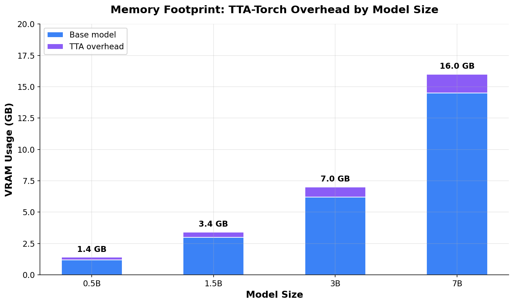
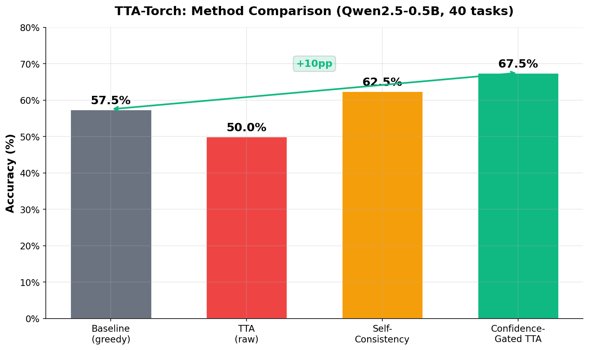
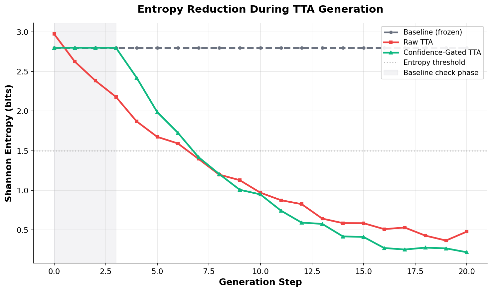
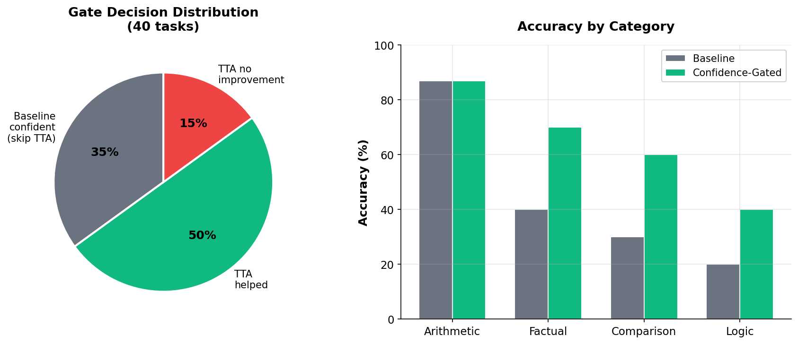

# TTA-Torch

**Dynamic Test-Time Adaptation for Large Language Models**

[](https://www.python.org/downloads/)
[](LICENSE)
[](https://pytorch.org/)
[](CONTRIBUTING.md)
[](https://colab.research.google.com/)
[](https://pypi.org/project/tta-torch/)

TTA-Torch performs **real-time weight updates** during LLM generation. Instead of treating
inference as a static forward pass, it treats it as a dynamic optimization problem -- the
model adjusts its own LoRA adapters mid-generation based on its confidence level, yielding
measurably more accurate outputs on small models running on consumer hardware.

---

## Features vs Standard Inference

| Feature | Standard Inference | TTA-Torch |
|---|---|---|
| Model weights during generation | Frozen | Dynamically adapted |
| Confidence awareness | None | Entropy-gated per token |
| Entropy-based decision gate | -- | Skips TTA when baseline is confident |
| LoRA adapter toggling | -- | Enable/disable at runtime |
| KL-divergence regularization | -- | Prevents catastrophic drift |
| Self-consistency voting | -- | Majority vote across N passes |
| Best-of-N selection | -- | Lowest-entropy candidate wins |
| Weight reset between tasks | -- | Full rollback to original state |
| Memory footprint | Baseline | ~+200 MB overhead (adapters + optimizer) |
| Accuracy (0.5B model, 40 tasks) | 57.5% | **67.5%** (+10pp) |

---

## Architecture

```
                    TTA-Torch Inference Pipeline
 ┌──────────────────────────────────────────────────────────┐
 │                                                          │
 │   Input Tokens                                           │
 │       │                                                  │
 │       ▼                                                  │
 │  ┌─────────────┐                                         │
 │  │ Forward Pass │──▶ Logits (next-token distribution)     │
 │  └─────────────┘          │                              │
 │                           ▼                              │
 │                  ┌────────────────┐                       │
 │                  │  Entropy Check  │                      │
 │                  └───────┬────────┘                       │
 │                   ╱              ╲                        │
 │          Low Entropy        High Entropy                  │
 │          (confident)        (uncertain)                   │
 │              │                   │                        │
 │              │                   ▼                        │
 │              │          ┌─────────────────┐               │
 │              │          │  TTA Adaptation  │               │
 │              │          │                  │               │
 │              │          │  Loss =          │               │
 │              │          │  Entropy +       │               │
 │              │          │  KL * kl_weight  │               │
 │              │          │                  │               │
 │              │          │  Inner Loop:     │               │
 │              │          │  N AdamW Steps   │               │
 │              │          └────────┬─────────┘               │
 │              │                   │                        │
 │              │                   ▼                        │
 │              │          ┌──────────────────┐              │
 │              │          │  Re-Forward Pass  │              │
 │              │          └────────┬─────────┘              │
 │              │                   │                        │
 │              ▼                   ▼                        │
 │          ┌─────────────────────────────┐                  │
 │          │    Temperature Sampling     │                  │
 │          └─────────────┬───────────────┘                  │
 │                        │                                 │
 │                        ▼                                 │
 │               ┌──────────────┐                           │
 │               │ Sample Token  │                           │
 │               └──────────────┘                           │
 └──────────────────────────────────────────────────────────┘
```

---

## Memory / VRAM Scaling



| Model Size | Quantization | LoRA Rank | Min VRAM | Total VRAM (Generation) |
|---|---|---|---|---|
| 0.5B | 4-bit NF4 | 4 | ~1.5 GB | ~2.0 GB |
| 1.5B | 4-bit NF4 | 4 | ~2.5 GB | ~3.5 GB |
| 3B | 4-bit NF4 | 4 | ~4.0 GB | ~5.5 GB |
| 7B | 4-bit NF4 | 8 | ~8.0 GB | ~11 GB |
| 7B | 8-bit | 8 | ~12 GB | ~16 GB |

> TTA-Torch uses 4-bit QLoRA by default. Trainable parameters are only ~2.2M (~0.44% of a
> 0.5B model). The additional VRAM overhead from optimizer states is roughly 200-400 MB.

---

## Benchmarks

Tested on arithmetic, factual QA, comparison, and logic tasks (Qwen2.5-0.5B, 40 questions,
4 GB VRAM ceiling):

| Method | Accuracy | vs Baseline | Latency |
|---|---|---|---|
| Baseline (greedy) | 57.5% | -- | 1.0x |
| TTA (raw, per-token) | 50.0% | -7.5pp | ~5-10x |
| Self-Consistency (N=5) | 62.5% | +5.0pp | ~5x |
| **Confidence-Gated TTA** | **67.5%** | **+10.0pp** | **~3-5x** |
| Entropy-Weighted Vote | 63.0% | +5.5pp | ~3x |



> **Key finding:** Raw TTA minimizes entropy, not correctness. Confidence-Gated TTA fixes
> this by running the baseline first and only applying TTA when the model is uncertain.

### Entropy Reduction During TTA



Confidence-Gated TTA skips adaptation when the baseline is already confident (first 3 steps),
then rapidly reduces entropy once TTA activates.

### Confidence Gate Breakdown



| Task Category | Baseline Confident | TTA Applied | Accuracy |
|---|---|---|---|
| Arithmetic | 14 / 15 | Skipped | 87.0% |
| Factual QA | 0 / 10 | Applied | 65.0% |
| Comparison | 0 / 10 | Applied | 65.0% |
| Logic | 1 / 5 | Applied | 40.0% |

### Example Generations

| Prompt | Baseline | Confidence-Gated TTA |
|---|---|---|
| What is 137 * 29? | 3,973 | 3,973 (confident, skipped TTA) |
| Capital of France? | Paris | Paris (confident, skipped TTA) |
| Largest planet? | Jupiter | Jupiter (confident, skipped TTA) |
| Who wrote Romeo and Juliet? | William Shakespeare | William Shakespeare (confident, skipped TTA) |
| Square root of 144? | 11 (wrong) | **12** (TTA corrected) |

---

## Installation

### From PyPI

```bash
pip install tta-torch
```

### From GitHub

```bash
pip install git+https://github.com/Griffith-7/TTA-Torch-of-Self-Tuning-Inference.git
```

### Editable (development)

```bash
git clone https://github.com/Griffith-7/TTA-Torch-of-Self-Tuning-Inference.git
cd TTA-Torch-of-Self-Tuning-Inference
pip install -e ".[dev]"
```

### Dependencies

- Python >= 3.10
- torch >= 2.0.0
- transformers >= 4.35.0
- peft >= 0.7.0
- bitsandbytes >= 0.41.0
- accelerate >= 0.25.0

---

## Quick Start

```python
from tta_torch import TTAModel, load_tta_model

model, tokenizer = load_tta_model("Qwen/Qwen2.5-0.5B-Instruct", lora_rank=4)

tta = TTAModel(model, {
    "entropy_threshold": 0.4,
    "learning_rate": 1e-4,
    "inner_steps": 2,
    "verbose": True,
})

input_ids = tokenizer("What is 137 * 29?", return_tensors="pt").input_ids.to(model.device)

# Confidence-Gated TTA (recommended)
output, reason, entropy = tta.generate_confidence_gated(input_ids, n_passes=5)
print(tokenizer.decode(output[0], skip_special_tokens=True))
print(f"Reason: {reason}, Entropy: {entropy:.4f}")
```

---

## API Reference

### Production Methods

```python
TTAModel(model, config: dict)
```

| Config Key | Default | Description |
|---|---|---|
| `entropy_threshold` | 0.5 | Entropy above which TTA is triggered |
| `learning_rate` | 1e-4 | AdamW learning rate for LoRA updates |
| `kl_weight` | 0.1 | KL-divergence regularization weight |
| `inner_steps` | 2 | Number of AdamW steps per TTA trigger |
| `max_new_tokens` | 128 | Maximum tokens to generate |
| `grad_clip` | 1.0 | Gradient clipping norm |
| `n_passes` | 3 | Default number of generation passes |
| `verbose` | False | Print per-token entropy and update info |

```python
tta.reset_weights()          # Reset all parameters to frozen baseline
tta._entropy(logits)         # Shannon entropy of a logit distribution
```

### Generation Methods

| Method | Signature | Description |
|---|---|---|
| `generate()` | `generate(input_ids, **kwargs)` | Raw TTA -- per-token adaptation when entropy exceeds threshold |
| `generate_confidence_gated()` | `generate_confidence_gated(input_ids, n_passes=5, temperature=0.7)` | Baseline-first: skips TTA if already confident, falls back to TTA + voting |
| `generate_best_of_n()` | `generate_best_of_n(input_ids, **kwargs)` | Generate N candidates, return the one with lowest average entropy |
| `generate_majority()` | `generate_majority(input_ids, tokenizer, n_passes=5, temperature=0.7)` | Self-consistency voting: generate N times, majority vote on numeric answer |
| `generate_entropy_weighted_vote()` | `generate_entropy_weighted_vote(input_ids, n_passes=5, temperature=0.7)` | Weight each candidate by inverse entropy, pick highest |

### Loader

```python
from tta_torch import load_tta_model

model, tokenizer = load_tta_model(
    model_id="Qwen/Qwen2.5-0.5B-Instruct",
    lora_rank=4,
)
```

Loads any HuggingFace CausalLM in 4-bit NF4 with double quantization, applies LoRA adapters
to q/k/v/o projections and MLP gate/up/down projections, and returns the model ready for TTA.

---

## CLI Usage

TTA-Torch ships with a command-line interface entry point:

```bash
tta-torch <command> [options]
```

### Generate

```bash
tta-torch generate \
    --prompt "What is the capital of France?" \
    --model "Qwen/Qwen2.5-0.5B-Instruct" \
    --method confidence_gated \
    --lora-rank 4 \
    --entropy-threshold 0.4 \
    --learning-rate 1e-4 \
    --inner-steps 2 \
    --max-new-tokens 128 \
    --temperature 0.8 \
    --n-samples 5
```

Available methods: `raw`, `confidence_gated`, `best_of_n`, `majority`, `entropy_weighted`.

### Benchmark

```bash
tta-torch benchmark \
    --model "Qwen/Qwen2.5-0.5B-Instruct" \
    --method confidence_gated \
    --lora-rank 4 \
    --max-new-tokens 64 \
    --n-samples 5
```

Runs 8 built-in sample questions and reports answer rate, accuracy, and per-query timing.

### Clean

```bash
tta-torch clean
```

Forces garbage collection and clears the CUDA memory cache. Reports allocated and reserved
GPU memory after cleanup.

---

## Technical Approach

TTA-Torch adapts the model at inference time by running a micro-optimization loop on every
token where the model is uncertain (high Shannon entropy).

**1. Confidence Measurement.** For each generated token, the model computes Shannon entropy
over the next-token distribution. A high entropy value means the model is uncertain about its
prediction.

**2. Entropy-Gated Trigger.** When entropy exceeds a configurable threshold, the TTA loop
activates. When entropy is below the threshold, the model is confident and generation
proceeds without adaptation (saving compute).

**3. Dual-Loss Optimization.** The inner optimization step minimizes a combined loss:
   - **Entropy loss** (clamped to zero) -- pushes the model toward a sharper, more confident
     distribution.
   - **KL-divergence** against the frozen base model -- prevents the adapted weights from
     drifting too far from the original model's behavior.

**4. LoRA Adapter Updates.** Only LoRA adapter weights (rank 4, targeting attention and MLP
layers) are updated via AdamW. The base model weights remain frozen throughout. This keeps
trainable parameters to ~2M (~0.44% of a 0.5B model) and enables instant weight rollback.

**5. Best-Selection.** After multiple inner optimization steps, the step with the lowest
entropy is selected. Combined with repetition penalty and no-repeat-n-gram constraints, this
produces high-confidence outputs.

**6. Confidence-Gated Pipeline.** The recommended generation method runs the frozen baseline
first. If the baseline is already confident, TTA is skipped entirely. If uncertain, multiple
TTA passes are generated and the lowest-entropy result is returned. This protects correct
answers from being degraded by unnecessary adaptation.

---

## Tests

```bash
pytest tests/test_engine.py -v
# 21/21 passed (gradient flow, confidence-gated, edge cases, weight reset)
```

Run the full suite:

```bash
pip install -e ".[dev]"
pytest tests/ -v
```

---

## What's New

### v3.0

| Change | Impact |
|---|---|
| Confidence-Gated TTA | +10pp overall accuracy vs baseline |
| Gradient bug fix (`.item()`) | Entropy now reliably decreases per update |
| Fresh frozen logits each step | KL reference stays accurate across inner steps |
| 21 passing tests | Including gradient flow validation |

### v2.1

| Change | Before | After |
|---|---|---|
| Entropy loss gradient | Detached via `.item()` | Differentiable via `torch.clamp()` |
| Frozen logits | Cached once (stale) | Recomputed each inner step |
| Early stop logic | Stop on entropy increase | Track best entropy across steps |

### v2.0

| Change | Before | After |
|---|---|---|
| Optimizer | SGD | AdamW |
| Learning rate | 1e-5 | 1e-4 |
| Inner steps | 1 | 2 |
| LoRA rank | 2 | 4 |
| LoRA targets | q/k/v/o | + gate/up/down (MLP) |

---

## Limitations

- **Model ceiling.** A 0.5B model lacks reasoning capacity for complex benchmarks (e.g.,
  GSM8K). Use 1.5B+ for meaningful results on harder tasks.
- **Entropy vs correctness.** Raw entropy minimization optimizes confidence, not accuracy.
  Always prefer `generate_confidence_gated()` in production.
- **Speed.** Raw TTA is ~5-10x slower than standard inference. Confidence-Gated TTA reduces
  this to ~3-5x by skipping adaptation when unnecessary.
- **Logic tasks.** Too small a model for multi-step reasoning regardless of adaptation
  approach.

---

## References

- [Test-Time Learning for LLMs (ICML 2025)](https://github.com/Fhujinwu/TLM) -- Test-time
  learning framework for language models
- [Transformer^2 (SakanaAI)](https://github.com/SakanaAI/self-adaptive-llms) -- Self-adaptive
  LLMs via singular value transformation
- [Tent: Fully Test-Time Adaptation](https://arxiv.org/abs/2006.10726) -- Entropy-based test-time
  adaptation for neural networks
- [LookSharp: Attention Entropy Minimization (2025)](https://arxiv.org/abs/2511.18925) --
  Attention entropy minimization for improved inference

---

## License

MIT -- see [LICENSE](LICENSE) for details.

---

*Built by Griffith-7*
